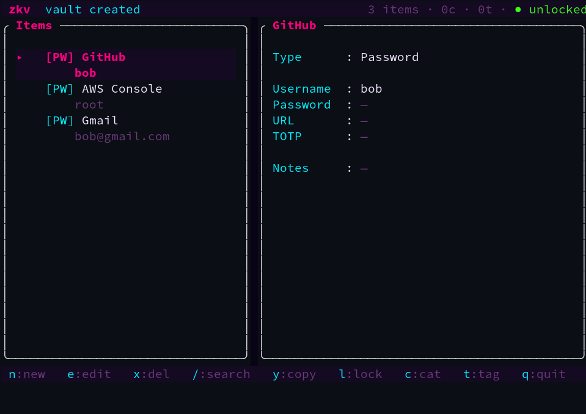
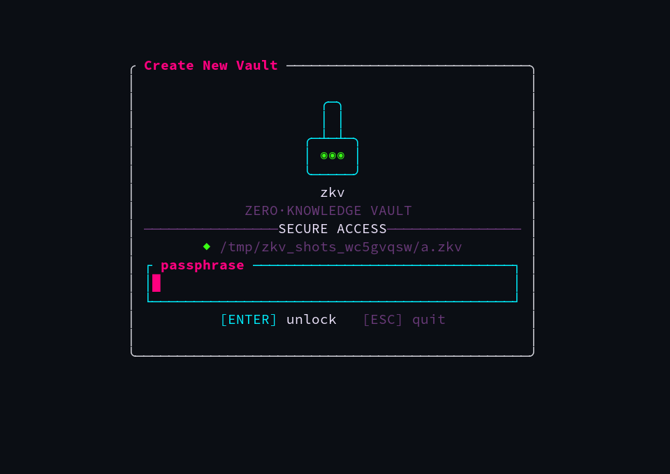
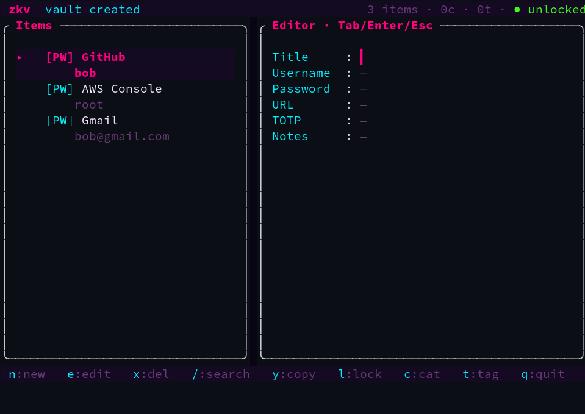
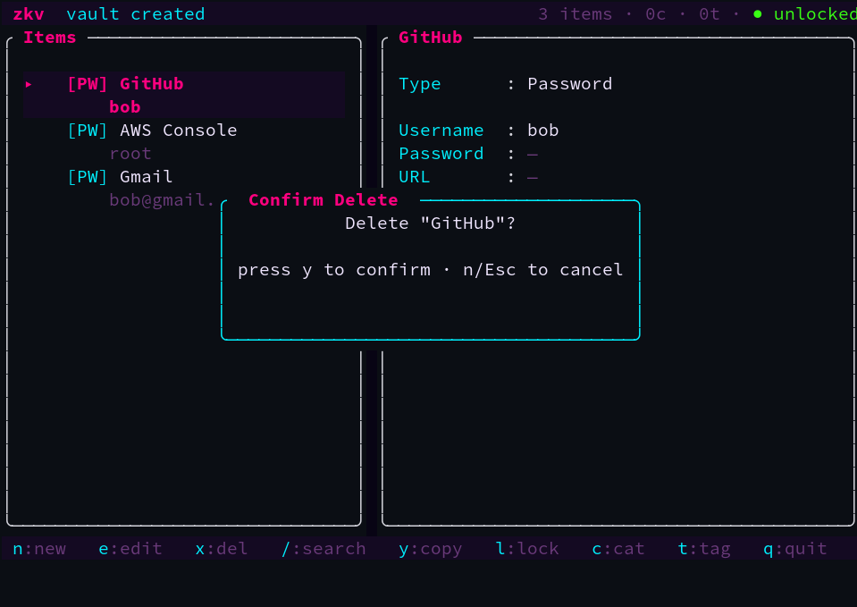

# zkv · 零知识保险箱

> 🔐 本地优先、端到端加密的个人数据保险箱。口令不出本机,密钥不落盘,`.zkv` 文件离开你的电脑就是一堆无意义的密文。

[English](README_en.md) | 中文


一个跑在终端里的密码 / 笔记 / 卡片管理器,采用科幻风 TUI([ratatui-sci-fi](https://crates.io/crates/ratatui-sci-fi) Cyberpunk 主题),所有数据经 **Argon2id + XChaCha20-Poly1305** 整库加密;并附带一套**可脚本化、无需 TTY 的无头 CLI**。

---

## ✨ 特性

- 🔒 **零知识加密** — Argon2id 从口令派生密钥,XChaCha20-Poly1305 整库加密;密钥用完即清零,绝不落盘。
- 🗄️ **多库支持** — 每个 `.zkv` 文件独立口令,可同时管理多个保险箱。
- 📇 **多类型条目** — 密码、笔记、卡片三类预设;字段以 JSON 存储,扩展自由。
- 🔎 **全文搜索** — 基于 SQLite FTS5,按标题与内容检索。
- 🏷️ **分类与标签** — 树状分类 + 多对多标签 + 收藏,任意组合过滤。
- 🖼️ **附件内嵌** — 图片 / 电子档直接存入数据库,随库加密。
- 🔢 **TOTP 验证码** — 存储 2FA 密钥并实时生成 6 位验证码(RFC 6238)。
- 🎲 **密码生成** — CSPRNG 强随机密码(可配长度 / 符号 / 易混字符)。
- 💻 **无头 CLI** — 全功能命令行,可脚本化、无需 TTY,口令取自环境变量 / 文件 / 交互。
- 🔁 **导入 / 导出** — JSON 无损往返,或 CSV(password 扁平),便于迁移与备份。
- 🎨 **科幻风 TUI** — header 状态栏 + 列表/详情两栏 + 底部键位栏,圆角霓虹面板,键盘驱动。
- ⏱️ **安全细节** — 复制密码后剪贴板 20 秒自动清空;闲置自动锁定;原子写盘防损坏;文件权限 0600。

## 🖥️ 预览

**浏览态** — 列表 + 详情两栏,密码字段掩码,顶部状态栏显示条目数与锁定态:



创建库口令屏、新建条目编辑器、删除确认模态:

| 创建库 | 新建条目编辑器 | 删除确认 |
| :---: | :---: | :---: |
|  |  |  |

> 截图由 [`tests/screenshot.py`](tests/screenshot.py) 驱动真实 `zkv` 二进制、在 Xvfb 里用真 `xterm` 渲染生成(`just shots`)。

## 🚀 快速开始

需要 Rust 1.85+(edition 2024)。

```bash
git clone <repo-url> zkv && cd zkv
cargo run --release -- new  ~/my.zkv     # 创建新库(进入 TUI 设口令)
cargo run --release -- open ~/my.zkv     # 打开已有库(进入 TUI 输口令)
```

或安装到 `$CARGO_HOME/bin`:

```bash
cargo install --path .
zkv new ~/my.zkv
```

## 💻 无头 CLI

与 TUI 平行、**可脚本化、无需 TTY**(口令取自 `ZKV_PASSPHRASE` 环境变量 / `--passfile` / 交互提示):

```bash
zkv init   ~/my.zkv                              # 非交互建库(已存在则报错,不覆盖)
zkv gen    [24] [--no-symbols] [--no-ambiguous]  # 生成强随机密码(无需库)
# 条目 CRUD(<id> 可换成 --find <标题前缀> 定位):
zkv ls     ~/my.zkv [-t password] [--tag T] [--cat C] [-q github] [-F|--favorite] [--json]
zkv get    ~/my.zkv <id> [-f password]           # -f 打印原始字段,便于管道
zkv search ~/my.zkv <query>
zkv otp    ~/my.zkv <id>                         # 打印当前 TOTP 6 位码
zkv cp     ~/my.zkv <id> [-f otp] [--clear 20]   # 复制字段(或实时 TOTP 码)到剪贴板
zkv add    ~/my.zkv --title T --data '<ItemData JSON>' [--tag T] [--cat C] [--favorite] [--gen-password[=LEN]] [--otpauth 'otpauth://...']
zkv edit   ~/my.zkv <id> [--title T | --username/--password/--url/--totp/--notes/...] [--add-tag T | --rm-tag T] [--cat C] [--otpauth 'otpauth://...']
zkv rm     ~/my.zkv <id> [-y]
# 分类 / 标签 / 附件管理:
zkv cat  add|rm|ls   ~/my.zkv ...
zkv tag  ls|rm|mv    ~/my.zkv ...
zkv attach add|ls|get|rm ~/my.zkv <id> ...       # get 支持 -o 文件或 stdout(二进制安全)
# 导入 / 导出(JSON 无损;CSV 仅 password):
zkv export ~/my.zkv --format json|csv [-o file]
zkv import ~/my.zkv --format json|csv [-i file]
```

例:`ZKV_PASSPHRASE=secret zkv ls vault.zkv --type password --json` · `zkv otp vault.zkv 3` · `code=$(zkv gen 24)`。

## ⌨️ TUI 操作指南

| 键 | 动作 |
| --- | --- |
| `n` | 新建条目(密码 / 笔记 / 卡片) |
| `e` | 编辑当前条目 |
| `x` | 删除当前条目(需确认) |
| `/` | 搜索 |
| `j` / `k`,`↑` / `↓` | 上下移动 |
| `y` | 复制密码到剪贴板(20s 后自动清空) |
| `o` | 复制当前 TOTP 验证码 |
| `a` | 附件管理(添加 / 导出 / 删除) |
| `l` | 立即锁定(清空内存中的密钥与数据) |
| `c` / `t` | 分类 / 标签管理(增删改) |
| `Tab` / `↑` / `↓` | 编辑时切换字段 |
| `Enter` | 保存 / 确认 / 提交口令 |
| `Esc` | 取消 / 返回 |
| `q` | 退出 |

> **自动锁定**:TUI 无操作超过 `ZKV_LOCK_SECS`(默认 300 秒,`0` 禁用)自动上锁,可直接原地重输口令恢复。

## 🛡️ 安全设计

**加密方案**

| 用途 | 算法 | 参数 |
| --- | --- | --- |
| 口令派生 (KDF) | Argon2id | m=64MiB, t=3, p=4, salt=16B, 输出 32B |
| 对称加密 | XChaCha20-Poly1305 | key=32B, nonce=24B(每次随机), tag=16B(AEAD) |
| TOTP | RFC 6238 | HMAC-SHA1, 30s, 6 位, base32 密钥 |

**加密粒度**:整个 SQLite 数据库作为一个 blob 加密。解锁时解密载入**内存**(`:memory:`),退出 / 锁定时清零;保存时用缓存的派生密钥重新加密(每次生成新 nonce,**不重跑 Argon2**)原子写回。明文从不在磁盘长期存在。

**威胁模型**
- ✅ 防御:`.zkv` 文件被离线窃取后只能暴力破解口令(Argon2id 拉高成本);明文不落盘;临时文件 0600 且名取自 CSPRNG;元数据(条目数、标签名等)整体加密不可见;复制密码 20s 自动清空剪贴板;闲置自动锁定。
- ⚠️ 不防御:本机已被完全攻陷(键盘记录器、内存 dump、冷启动攻击)。
- ⚠️ **忘记口令 = 数据不可恢复**。零知识的必然代价 —— 请妥善备份口令与 `.zkv` 文件。

## 🧱 技术栈

- **语言**:Rust(edition 2024)
- **TUI**:[ratatui](https://crates.io/crates/ratatui) · [crossterm](https://crates.io/crates/crossterm) · [ratatui-sci-fi](https://crates.io/crates/ratatui-sci-fi)
- **数据库**:[rusqlite](https://crates.io/crates/rusqlite)(bundled SQLite,含 FTS5)
- **加密**:[argon2](https://crates.io/crates/argon2) · [chacha20poly1305](https://crates.io/crates/chacha20poly1305) · [zeroize](https://crates.io/crates/zeroize) · [secrecy](https://crates.io/crates/secrecy)
- **TOTP**:[hmac](https://crates.io/crates/hmac) · [sha1](https://crates.io/crates/sha1) · [data-encoding](https://crates.io/crates/data-encoding)
- **其他**:[clap](https://crates.io/crates/clap)、[serde](https://crates.io/crates/serde)、[thiserror](https://crates.io/crates/thiserror)、[color-eyre](https://crates.io/crates/color-eyre)、[rpassword](https://crates.io/crates/rpassword)、[getrandom](https://crates.io/crates/getrandom)

## 🏗️ 架构

分层设计,单向依赖(下层不引用上层),遵循 MVC(`App` = Model + Controller,UI = View):

```
error(L0) → crypto/model/totp(L1) → db/vault(L2) → store/search/clipboard(L3) → app(L4) → ui(L5) → main(L6)
                                                                   ↘ cli(无头前端,与 ui 平行)
```

详见 [docs/PROGRESS.md](docs/PROGRESS.md) 与 [docs/prd/zkv.md](docs/prd/zkv.md)。

## 📄 `.zkv` 文件格式

小端序,58 字节定长头 + 密文:

```
[4 "ZKV1"][1 ver][1 flags][4 m_kib][4 t_cost][4 p_cost][16 salt][24 nonce][N ciphertext]
```

KDF 参数随文件存储,便于未来调参而旧文件仍可解析;Poly1305 校验失败即判定口令错误或文件损坏。

## 🛠️ 开发

```bash
cargo test             # 单元 / 集成测试(176 passed)
cargo clippy --all-targets  # 0 warning
just e2e               # PTY 端到端(驱动真实二进制,6 用例)
cargo build --release  # 发布构建
```

## 🗺️ 路线图

- [x] 分类 / 标签的增删改(CLI + TUI)
- [x] 导入 / 导出(JSON / CSV)
- [x] TOTP 验证码 + 无头 CLI + 闲置自动锁定
- [ ] 自定义字段模板
- [ ] KeePass 导入 / 导出
- [ ] 大库 per-page 加密优化(按需:当前整库模型 <100MB 每次保存约 50–200ms,收益微小;详见 [PROGRESS.md](docs/PROGRESS.md) 2026-06-21 决策)
- [ ] Windows 剪贴板后端

## 📜 许可证

MIT
